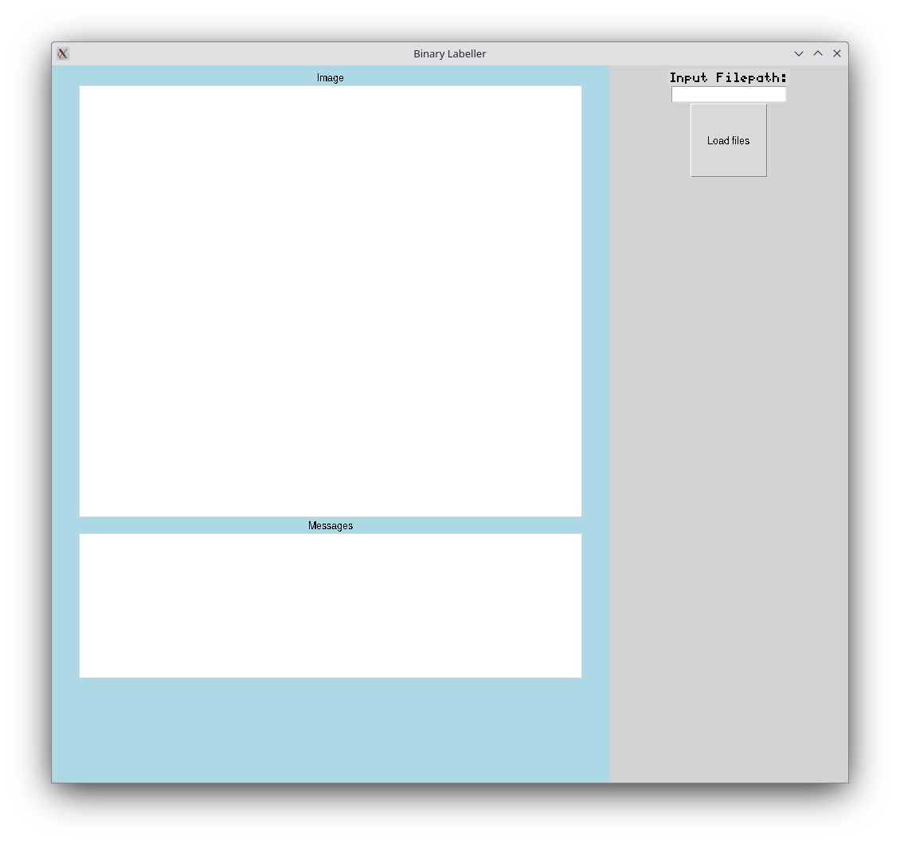

Binary-choice (Y vs N) image labeller.

# Usage

Run `labeller_gui.py` to open the GUI window.

## GUI Window

The GUI window has two columns. On the right is the path input with a button to load files. The "Input Filepath" is for the path to the directory containing the pngs to be labelled.

On the left are the "Image" and "Messages" displays, which show the active image (for labelling) and active status respectively.

## Usage

1. Input the folder containing pngs.
2. Press the "Load files" button. The first image in the folder should show up under "Image"
3. Label the image by pressing the `Up` or `Down` key to label for positive (will move the image to a subdirectory "Y" and append "Y" to the image filename) or negative (will do the same with "N") respectively.
4. Press enter to confirm the label. Before this confirmation, the label can be changed by pressing `Up` or `Down`.
5. The next image will be loaded for labelling in the same way.

Images will be divided into the subdirectories `<folder>/Y` and `<folder>/N`.
